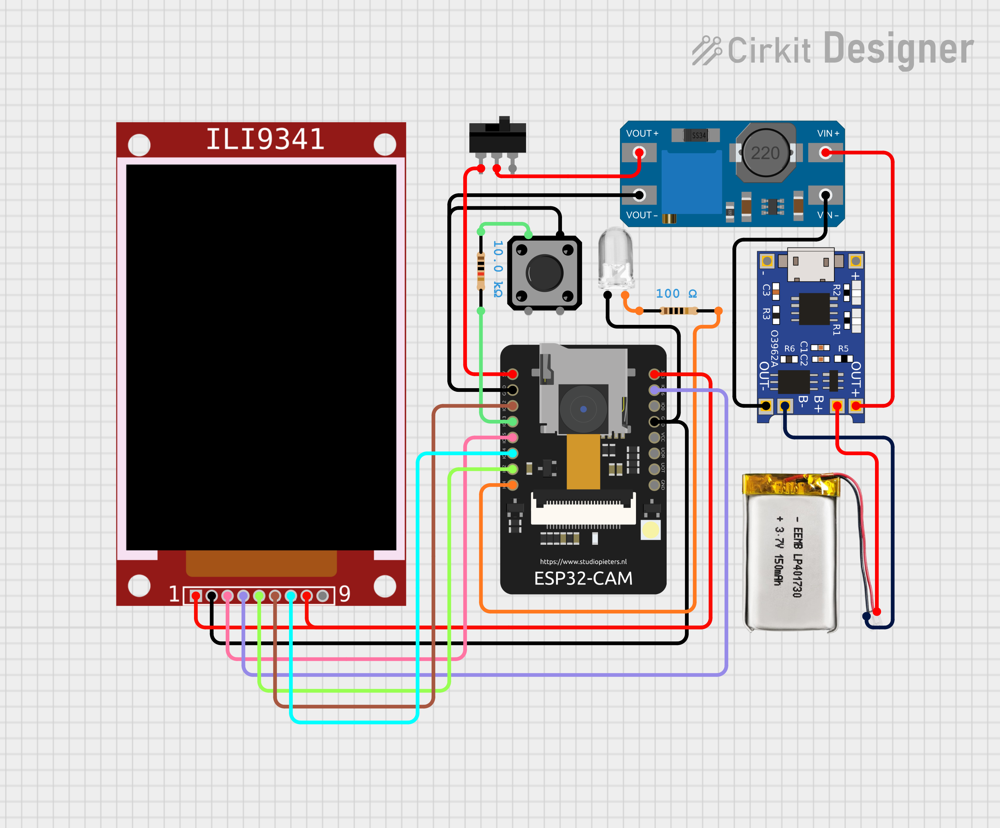

# Conan-AI-Cam

Conan-AI-Cam is an embedded AI vision project that performs real-time object detection on the edge using an ESP32-CAM. The system captures live video, runs an on-device machine learning (TinyML) model, and displays detection results such as class labels on a TFT LCD or streams them wirelessly.

---

## Features

- Real-time object detection on ESP32-CAM
- On-device AI inference (TinyML)
- Live camera preview
- Class label display
- TFT LCD display support (ILI9341)
- Low-power, fully embedded system

---

## Technology Stack

- Microcontroller: ESP32 / ESP32-CAM
- Camera: OV3640
- Display: ILI9341 TFT (240x320)
- AI Framework: Edge Impulse (TinyML)
- Programming Language: Arduino (C/C++)

Libraries:
- esp_camera
- TFT_eSPI
- Embedded_inferencing

---

## Hardware Requirements

- ESP32-CAM (AI Thinker or compatible)
- ILI9341 TFT LCD
- Push button
- White LED / flash
- 3.7v LiPo battery 500mAh
- Stranded Wires
- Resistor (10k and 100)
- MT3608 Booster (5v)
- TP4056 Charging Module

---

## Circuit Design

Link: https://app.cirkitdesigner.com/project/543aeb1d-fdce-4df9-b33e-9e808db49461

---

## Demonstration

Below is a demonstration of the Conan-AI-Cam in action:

|  |  |
|:-------------------------:|:-------------------------:|
|  |  |

Watch the full video demo on YouTube: [https://youtube.com/shorts/EPAwnLHnLsA?feature=share](https://youtube.com/shorts/EPAwnLHnLsA?feature=share)

---

## Object Detection Classes

The Edge Impulse model deployed on this project is trained to detect the following tools:

- Cutter
- Wire cutter
- Tape measure
- Electric tape
- Glue gun

---

## Operating Modes

Conan-AI-Cam supports three operating modes, controlled by the push button:

1. **Live Mode**
	- Default mode after startup.
	- Shows a real-time camera preview on the TFT display.

2. **Capture Mode**
	- Press the button once to enter capture mode.
	- The camera flashes, captures an image, and runs object detection.
	- The detected class label is displayed and the result is frozen until the next click.

3. **Continuous Mode**
	- Hold the button to activate continuous mode.
	- The camera repeatedly performs object detection at set intervals, flashing as needed.
	- Useful for hands-free, ongoing detection.

---

## Software Requirements

- Arduino IDE
- ESP32 Board Package (2.0.4 recommended)
- Edge Impulse Arduino Library

---

## Setup Instructions

1. **Install ESP32 board support** via Boards Manager in Arduino IDE.
2. **Import Edge Impulse Arduino library** (via Library Manager or .zip import).
3. **Configure TFT pins** in `User_Setup.h` for your display.
4. **Connect hardware** as per circuit diagram
5. **Open** `EMBEDDED_CAMERA_PROJECT/EMBEDDED_CAMERA_PROJECT.ino` in Arduino IDE. 
6. **Upload the code** to your ESP32-CAM.

---

## How It Works

1. Capture image from camera
2. Preprocess image
3. Run TinyML inference
4. Detect objects
5. Display class labels

---

## License

Educational and research use only.

---

## Author

Mark Jeric Exconde
Jasmine Q. Macalintal

